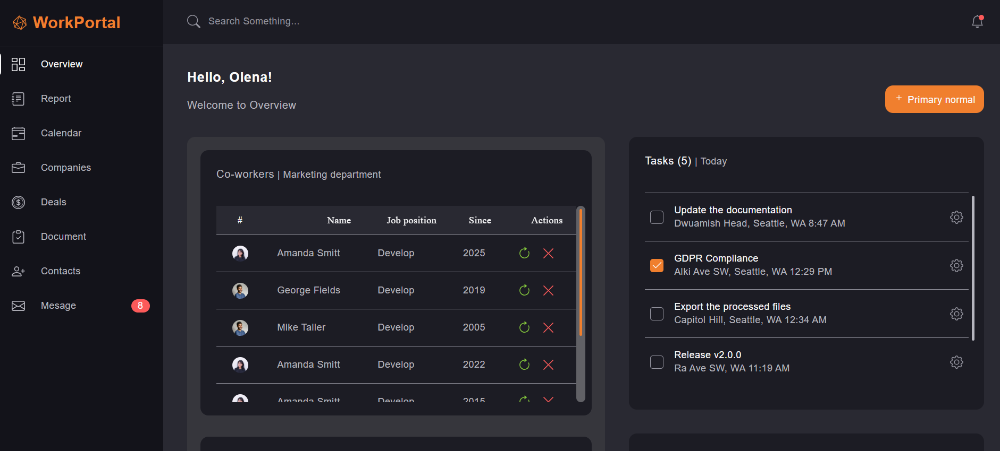
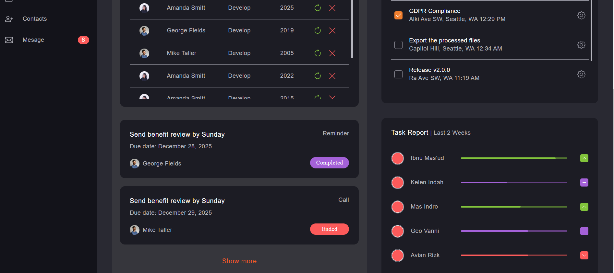

# Workers-app-Sass

<div style="display: flex; justify-content: space-between; gap: 10px;">
  
  
</div>
---

**Build Tools:** 🛠️

- Vite.js
- SASS
- Java Script
- HTML

## Configure the project structure:

**This is the structure of the project:** 👌

```plaintext
/
├── demo
├── dist
├── node_modules
├── public
├── src
│   ├── fonts
│   ├── img
│   ├── js
│   ├── scss
├── .gitignore
├── index.html
├── LICENSE
├── package-lock.json
├── package.json
├── postcss.config.cjs
├── README.md
├── vite.config.js
```

```json
"build": "vite build --base=/<REPO>/"
```

---

## Start development mode: 🚀

```bash
npm run dev
```

```bash
npm run dev watch
```

---

## License

This tamplate is created under [MIT License](LICENSE).
